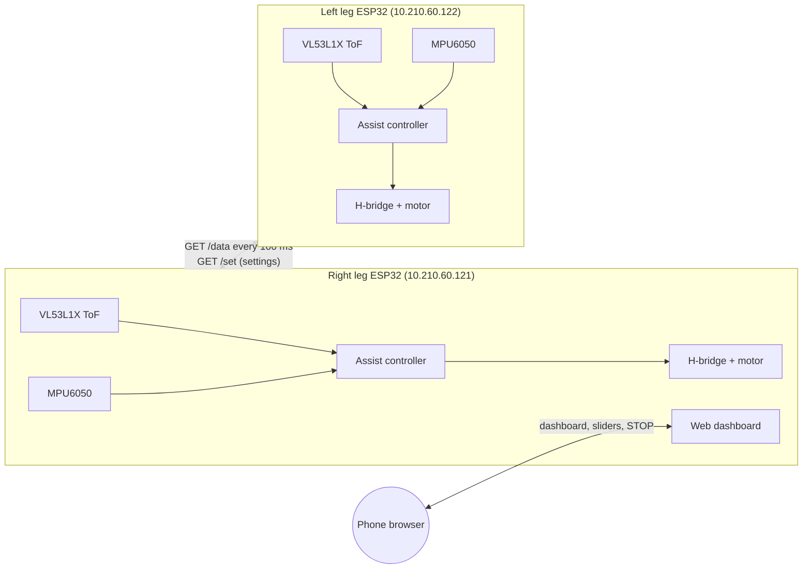

# StrideMate: Low-Cost Walking-Assist Exoskeleton

[](https://github.com/falakpat3l/stridemate-exoskeleton/actions/workflows/compile.yml)

StrideMate is a wearable lower-limb exoskeleton prototype that helps with walking. Each leg has its own **ESP32** with a distance sensor, a motion sensor and a motor. The two boards talk over Wi-Fi, and a phone dashboard shows live data and lets you set how much the motors help.

> [!WARNING]
> **Research prototype, not a medical device.** It hasn't been clinically validated or certified. Never test it on a person without supervision.
>
> ### 👉 If you are about to work on this, read **[BEFORE-YOU-FLASH-THIS.md](BEFORE-YOU-FLASH-THIS.md)** first.
>
> It is the honest state of the project: what is measured, what is guessed, and what has never been switched on. Then [docs/safety.md](docs/safety.md) before powering the motors.

## Highlights

| | |
|---|---|
| **Controllers** | 2 × ESP32 (one per leg), linked over Wi-Fi |
| **Sensing** | VL53L1X time-of-flight distance sensor + MPU6050 accelerometer/gyroscope on each leg |
| **Actuation** | Windshield-wiper DC motors driven by BTS7960-style H-bridges |
| **Structure** | CNC-machined aluminium thigh links, 3D-printed housings ([CAD files](https://github.com/falakpat3l/Stridemate_3D_IITH)) |
| **Weight / cost** | Under 4 kg · prototype about ₹15–18k (target retail about ₹40,000) |
| **Interface** | Phone web dashboard (no app, no internet needed): live data, motor load, assist strength, sensitivity, motor enable, STOP |
| **Updates** | Password-protected over-the-air (OTA) firmware updates |

## How it works



1. The distance sensor measures a distance (in mm) that changes as the leg moves. The firmware filters it and works out how fast it's changing (the **velocity**).
2. When the distance is between **50 and 450 mm** and the velocity is above the **sensitivity** threshold, the motor gets a command: `duty = 80 + 2.5 × |velocity|^1.5`. That value is capped at the **assist strength**, capped again by the remaining thermal budget, and smoothed so the motor ramps up gently.
   > Since v1.3.0 the default is the **proportional** curve (`ASSIST_CURVE_MODE 1`): velocity in mm/s, rising evenly across the speed range. The original per-sample curve is still available as mode 0. [how-it-works.md](docs/how-it-works.md) has the numbers.
3. The sign of the velocity sets the motor direction.
4. The right leg hosts the dashboard and passes your settings on to the left leg.

Full details: [docs/how-it-works.md](docs/how-it-works.md).

## Repository layout

```
firmware/
  right_leg/        Right-leg ESP32 firmware + dashboard   (maintained)
  left_leg/         Left-leg ESP32 firmware                (reconstructed, untested)
original/
  right_leg_original/   Prototype code exactly as handed over (Wi-Fi password removed)
docs/
  getting-started.md    Install, configure, flash, first run
  hardware.md           Components and wiring (pin map)
  how-it-works.md       Control algorithm and parameters
  api.md                HTTP endpoints of both boards
  safety.md             Safety features and first-test checklist
  changes-from-original.md   What changed from the prototype code, and why
```

## Quick start

1. Install the **Arduino IDE**, the **esp32 by Espressif** board package (version 3.x) and the **Adafruit VL53L1X** library.
2. In each firmware folder, copy `secrets.example.h` to `secrets.h` and fill in your Wi-Fi name, password and keys. `secrets.h` is never uploaded to GitHub.
3. Open `firmware/right_leg/right_leg.ino`, select **ESP32 Dev Module** and upload. Do the same for `firmware/left_leg/left_leg.ino` on the second board.
4. Connect your phone to the same Wi-Fi and open **http://10.210.60.121/**. Log in with the dashboard user and password from `secrets.h`.
5. The motors start **disabled**. Tap **Enable motor** only when the device is fitted and safe.

Step-by-step guide: [docs/getting-started.md](docs/getting-started.md).

## Project status

- ✅ Working prototype built (mechanics + electronics + dashboard).
- ✅ Right-leg firmware cleaned up, secured and compile-checked (see [changes](docs/changes-from-original.md)).
- ✅ Safety and security review applied: sensor-gap re-seeding, velocity clamp, H-bridge enables dropped on stop, I²C timeouts, control-loop watchdog, POST + same-origin on control endpoints.
- ⚠️ **Left-leg firmware is reconstructed.** The original wasn't available, so it hasn't been tested on hardware yet.
- ⚠️ The refactored right-leg firmware compiles but hasn't been re-tested on the physical device.
- ⚠️ Thermal fold-back ships **off** (`THERMAL_PROTECTION false`): the constants are simulated, not measured. The load estimate still runs and shows on the dashboard so you can calibrate it — see [docs/safety.md](docs/safety.md).
- ✅ Gyro and accelerometer fused for tilt (`USE_GYRO_FUSION`).
- ✅ Firmware support written for motor current sensing and motor-pack voltage — both ship disabled, waiting on the wiring. See the open issues.
- 🔜 Possible next steps: detect gait phases, log sessions, settle `ASSIST_CURVE_MODE`.

## Who continues this

The hardware is at **IIT Hyderabad**, with **B Dileep Kumar**
([@Dileep195](https://github.com/Dileep195)). The open issues labelled
`needs-bench-test` and `hardware` stay open because they need the physical
device: the software half of each is written and ships disabled, and what
remains is wiring, measuring and flashing.

Anyone continuing from there is doing their own work on it and holds the
copyright in what they write. See [NOTICE.md](NOTICE.md).

## Team

- **Falak Ameesh Patel** ([@falakpat3l](https://github.com/falakpat3l)): co-founder. Product, clinical research and mechanical design.
- **B Dileep Kumar** ([@Dileep195](https://github.com/Dileep195)): co-founder, technical lead. Wrote the original electronics and firmware.

## Related

- Mechanical CAD (Fusion 360 / STEP / STL): [falakpat3l/Stridemate_3D_IITH](https://github.com/falakpat3l/Stridemate_3D_IITH)

## Licence

Released under the **[PolyForm Noncommercial License 1.0.0](LICENSE.md)**: free for
personal, research, educational, charitable and government use; commercial use
needs a separate licence. For one, contact the copyright holder.

This is not an OSI-approved open-source licence, because no OSI-approved licence
restricts commercial use.

> `original/` is B Dileep Kumar's work and his copyright. [NOTICE.md](NOTICE.md)
> records what is still outstanding on that.

Mechanical CAD lives in [Stridemate_3D_IITH](https://github.com/falakpat3l/Stridemate_3D_IITH)
under CC BY-NC-SA 4.0.
