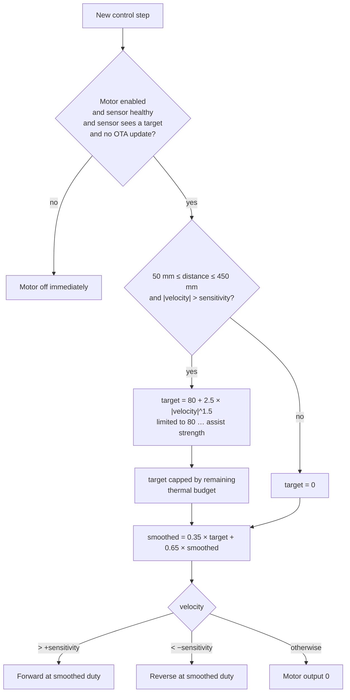

# How it works

## Control loop (each leg)

Every `CONTROL_PERIOD_MS` (10 ms) the firmware:

1. **Reads the distance sensor** if it has a new measurement.
   - Readings from 1 to 1999 mm are accepted, and the rest are ignored.
   - Low-pass filter: `filtered = 0.7 × raw + 0.3 × filtered`
   - `velocity = filtered − previous filtered`, in mm per new sensor sample, clamped to `MAX_VELOCITY_MM`.
   - If no **valid** reading arrived for `TOF_RESEED_AFTER_MS`, the filter is re-seeded from the new reading and velocity is reported as 0. Without this, re-acquiring a lost target looks like a movement of hundreds of mm in one sample.
   - An invalid reading (no target) reports velocity 0 rather than reusing the last value.
2. **Reads the MPU6050** and computes tilt from the accelerometer:
   `pitch = atan2(AcY, AcZ)`, `roll = atan2(AcX, AcZ)` (degrees).
   These values are shown on the dashboard but aren't used for control yet.
3. **Decides the motor command.**



If the direction flips while the motor is running, the output drops to 0 for one step and then ramps up again (`RESET_RAMP_ON_REVERSAL`).

## About the assist curve

`duty = 80 + 2.5 × |velocity|^1.5`, clamped to 255. Solving for the clamp:

```
((255 − 80) / 2.5)^(2/3) = 17.0 mm per sensor sample
```

**Above about 17 mm per sample the output is pinned at Assist Strength and the velocity term contributes nothing.** How fast that is in real terms depends entirely on the ToF sample period, which is why `TOF_TIMING_BUDGET_MS` is now pinned at 33 ms rather than left to the library default:

| ToF period | 100 mm/s | 200 mm/s | 400 mm/s | 800 mm/s |
|---|---|---|---|---|
| 20 ms | 2.0 | 4.0 | 8.0 | 16.0 |
| **33 ms** | 3.3 | 6.6 | 13.2 | **26.4** |
| 50 ms | 5.0 | 10.0 | **20.0** | **40.0** |
| 100 ms | 10.0 | **20.0** | **40.0** | **80.0** |

Bold values are past the clamp, where the velocity term stops contributing anything.

**Pinning the timing budget fixed most of this.** At 33 ms, 17 mm/sample works out to about **515 mm/s** — a brisk leg speed, not a shuffle. At the library default the saturation point sat far lower, which is what made the device effectively bang-bang. So the important fix was pinning the budget, not the curve itself.

What remains is a matter of shape and of principle:

- The curve is **convex** — slow at low speed, then steep — rather than proportional.
- Its behaviour still **depends on the sample period**. Change `TOF_TIMING_BUDGET_MS` and the tuning moves with it, silently.

`ASSIST_CURVE_MODE` in `config.h` offers both:

| Mode | Velocity unit | Saturates at | Depends on the timing budget? |
|---|---|---|---|
| **0** | mm per sensor sample | ~515 mm/s at 33 ms | Yes |
| **1** (default) | mm per second | `ASSIST_SPEED_FULL_MMS` (600 mm/s) | No |

Mode 1 measures the real interval between valid samples, so the tuning holds whatever the sensor is doing, and the response is linear across the range.

**Mode 1 is the default as of v1.3.0.** Sensitivity now means mm/s rather than mm per sample — one slider step is `SENSITIVITY_MMS_PER_STEP` (20 mm/s) — so it needs re-tuning on the bench. Set `ASSIST_CURVE_MODE` back to `0` for the original prototype's curve, exactly.

## Motor thermal budget

There is no current sensor and no thermistor on this build, so heating is **estimated**:

```
load += (duty² / THERMAL_FULL_DUTY_S − load / THERMAL_COOL_TAU_S) × dt
```

with `duty` normalised to 0–1. Past `THERMAL_WARN_LOAD` (0.80) the assist ceiling folds back smoothly toward `THERMAL_MIN_ASSIST_FRAC` (25%) of its range. It folds back rather than cutting out, because losing assist abruptly mid-stride is itself a hazard — and since a smaller duty also reduces heating, the loop settles instead of oscillating.

The timestep is **measured**, not assumed. It previously used a fixed `CONTROL_PERIOD_MS`, but the same loop serves HTTP and OTA, so whenever it is busy the real interval is longer and the estimate read low.

With `CURRENT_SENSE_ENABLED` the model integrates **real I²t** instead of duty², which is the difference between a measurement and a guess.

In simulation, no realistic walking profile reaches the warn point; a motor held at full duty starts folding back after about 56 s and settles at 80% assist.

**Fold-back is off by default** (`THERMAL_PROTECTION false`) because those constants are simulated, not measured. The load estimate still runs and still appears on the dashboard, so you can calibrate against real use before switching it on — see [safety.md](safety.md).

## Tunable parameters (`config.h`)

| Name | Default | Meaning |
|---|---|---|
| `MIN_DISTANCE_MM` / `MAX_DISTANCE_MM` | 50 / 450 | Assist only inside this distance window |
| `DISTANCE_ALPHA` | 0.7 | Distance filter (higher = faster, noisier) |
| `PWM_ALPHA` | 0.35 | Motor ramp smoothing (higher = snappier) |
| `PWM_MIN_ASSIST` | 80 | Lowest non-zero duty (overcomes motor friction) |
| `PWM_CURVE_GAIN` / `PWM_CURVE_EXPONENT` | 2.5 / 1.5 | Shape of the assist curve |
| `DEFAULT_ASSIST_STRENGTH` | 255 | Maximum duty (dashboard slider, 80–255) |
| `DEFAULT_SENSITIVITY` | 1 | Velocity dead-band (dashboard slider, 1–20) |
| `TOF_STALE_TIMEOUT_MS` | 500 | Motor off if the sensor stops reporting at all |
| `TOF_NO_TARGET_TIMEOUT_MS` | 500 | Motor off if the sensor reports but sees no target |
| `TOF_RESEED_AFTER_MS` | 150 | Re-seed the filter after a gap in valid readings |
| `MAX_VELOCITY_MM` | 30 | Ceiling on one sample's velocity (sensor artefacts) |
| `TOF_TIMING_BUDGET_MS` | 33 | Sensor sample period — **this is a control gain** |
| `MOTOR_DIRECTION_SIGN` | 1 | Set to −1 if this leg's motor is mirrored |
| `MOTOR_ENABLED_AT_BOOT` | false | Motor must be enabled from the dashboard |
| `THERMAL_FULL_DUTY_S` | 40 | duty²·seconds to reach the thermal budget |
| `THERMAL_COOL_TAU_S` | 45 | Cooling time constant |
| `THERMAL_WARN_LOAD` | 0.80 | Load at which assist starts folding back |
| `THERMAL_MIN_ASSIST_FRAC` | 0.25 | Floor for the fold-back |
| `MPU_I2C_TIMEOUT_MS` / `TOF_I2C_TIMEOUT_MS` | 20 | Never block the control loop |
| `CONTROL_WDT_TIMEOUT_MS` | 1000 | Watchdog reset if `loop()` stalls |
| `ASSIST_CURVE_MODE` | 0 | 0 = legacy per-sample curve, 1 = proportional mm/s |
| `ASSIST_SPEED_FULL_MMS` | 600 | Mode 1: speed at which assist reaches maximum |
| `SENSITIVITY_MMS_PER_STEP` | 20 | Mode 1: one Sensitivity slider step, in mm/s |
| `USE_GYRO_FUSION` | true | Complementary filter for tilt instead of accelerometer alone |
| `PACK_MONITOR_ENABLED` | false | Motor-pack voltage on a second divider |
| `CURRENT_SENSE_ENABLED` | false | BTS7960 current sense: real I²t and stall detection |
| `CURRENT_STALL_A` | 6.0 | Current that counts as a stall, with no leg movement |

## Two-leg communication

- The **right leg** runs a background task on the ESP32's second CPU core. Every 100 ms it:
  - requests `GET http://10.210.60.122/data` from the left leg (150 ms timeout), and
  - sends `GET /set?...` whenever a dashboard setting changes, plus every 2 s anyway.
- Because this runs separately from the control loop, a slow or missing left leg **never delays** the right-leg motor control.
- The **left leg** treats those requests as a heartbeat. If it hears nothing from the right leg for 1 s, it switches its motor off, because at that point the dashboard's STOP button could no longer reach it.

See [api.md](api.md) for the exact messages.
