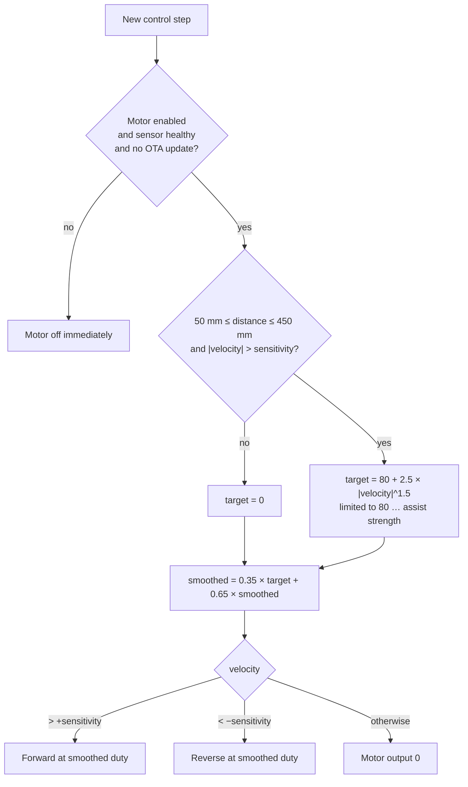

# How it works

## Control loop (each leg)

Every `CONTROL_PERIOD_MS` (10 ms) the firmware:

1. **Reads the distance sensor** if it has a new measurement.
   - Readings from 1 to 1999 mm are accepted, and the rest are ignored.
   - Low-pass filter: `filtered = 0.7 × raw + 0.3 × filtered`
   - `velocity = filtered − previous filtered`, in mm per new sensor sample.
2. **Reads the MPU6050** and computes tilt from the accelerometer:
   `pitch = atan2(AcY, AcZ)`, `roll = atan2(AcX, AcZ)` (degrees).
   These values are shown on the dashboard but aren't used for control yet.
3. **Decides the motor command.**

If the direction flips while the motor is running, the output drops to 0 for one step and then ramps up again (`RESET_RAMP_ON_REVERSAL`).

## Tunable parameters (`config.h`)

| Name | Default | Meaning |
|---|---|---|
| `MIN_DISTANCE_MM` / `MAX_DISTANCE_MM` | 50 / 450 | Assist only inside this distance window |
| `DISTANCE_ALPHA` | 0.7 | Distance filter (higher = faster, noisier) |
| `PWM_ALPHA` | 0.35 | Motor ramp smoothing (higher = snappier) |
| `PWM_MIN_ASSIST` | 80 | Lowest non-zero duty (overcomes motor friction) |
| `PWM_CURVE_GAIN` / `PWM_CURVE_EXPONENT` | 2.5 / 1.5 | Shape of the assist curve |
| `DEFAULT_ASSIST_STRENGTH` | 255 | Maximum duty (dashboard slider, 80–255) |
| `DEFAULT_SENSITIVITY` | 1 | Velocity dead-band (dashboard slider, 1–20) |
| `TOF_STALE_TIMEOUT_MS` | 500 | Motor off if the sensor stops reporting |
| `MOTOR_ENABLED_AT_BOOT` | false | Motor must be enabled from the dashboard |

## Two-leg communication

- The **right leg** runs a background task on the ESP32's second CPU core. Every 100 ms it:
  - requests `GET http://10.210.60.122/data` from the left leg (150 ms timeout), and
  - sends `GET /set?...` whenever a dashboard setting changes, plus every 2 s anyway.
- Because this runs separately from the control loop, a slow or missing left leg **never delays** the right-leg motor control.
- The **left leg** treats those requests as a heartbeat. If it hears nothing from the right leg for 1 s, it switches its motor off, because at that point the dashboard's STOP button could no longer reach it.

See [api.md](api.md) for the exact messages.
